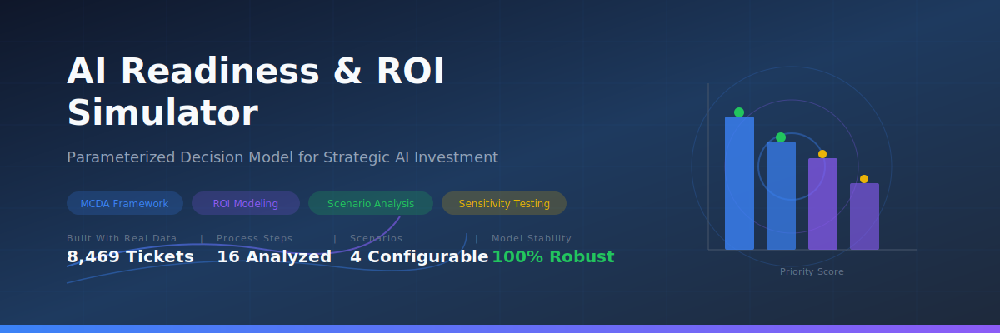
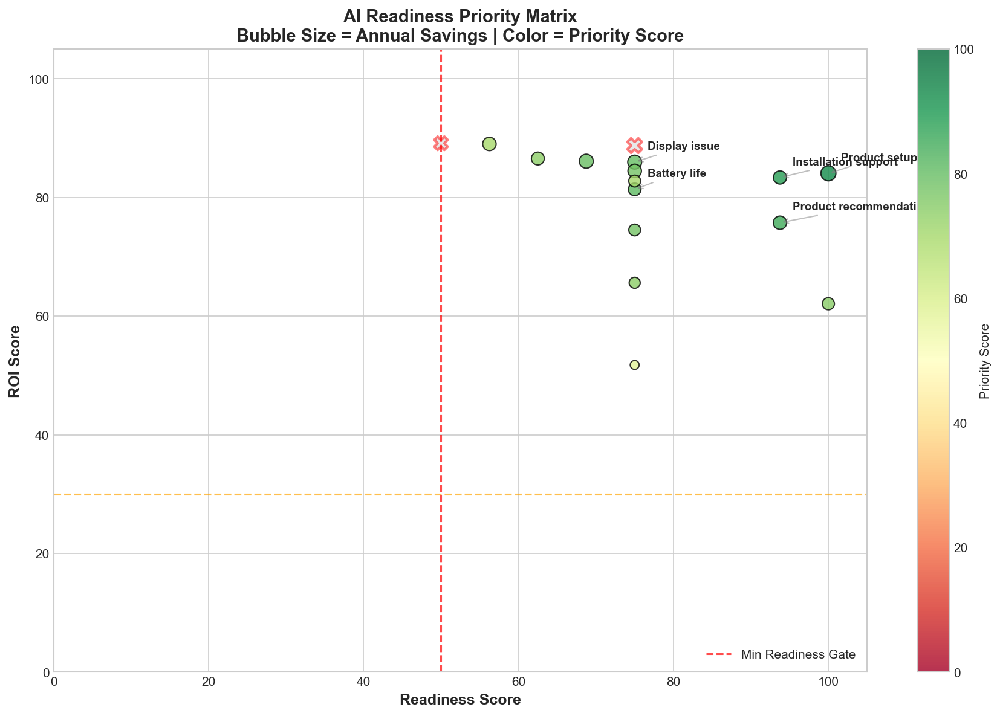
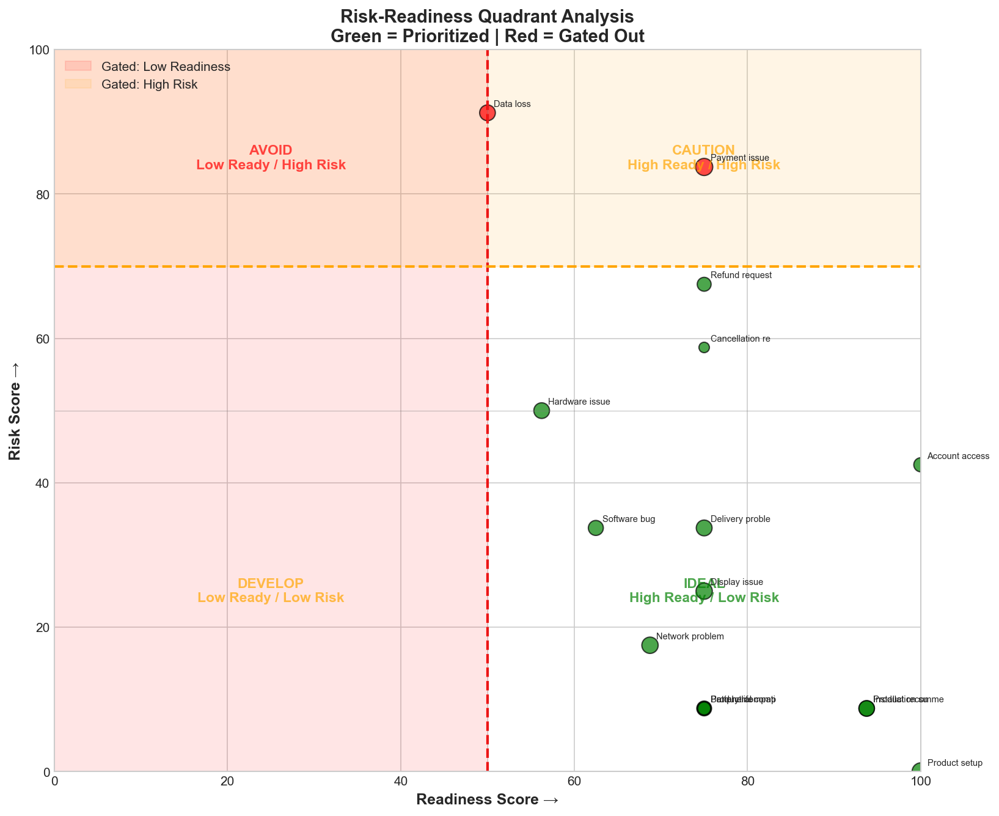
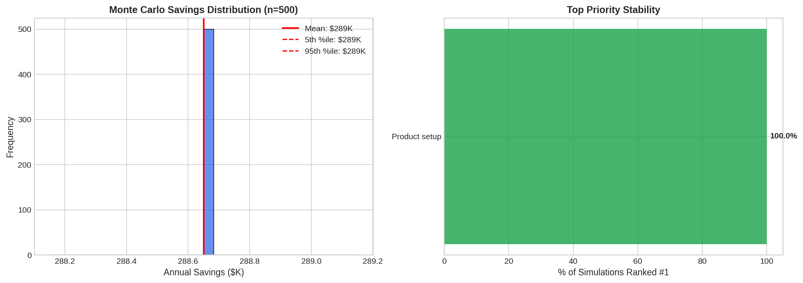
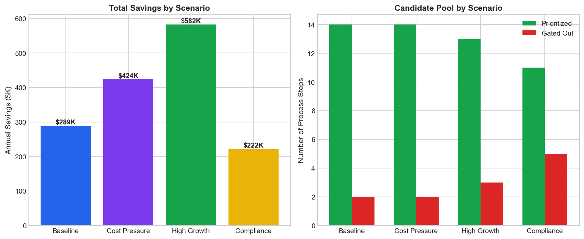
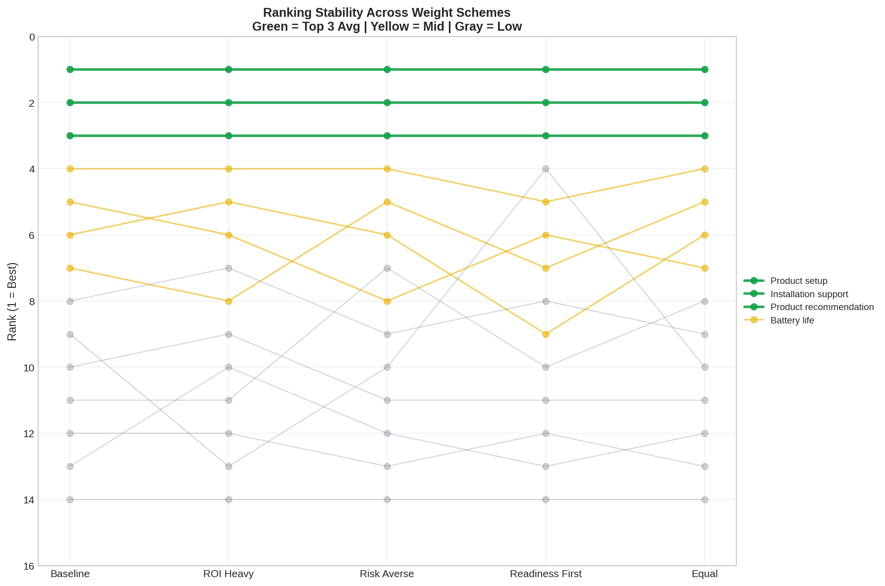

# AI Readiness & ROI Simulator



[](https://www.python.org/downloads/)
[](https://www.mathworks.com/)
[](LICENSE)

> **A parameterized Multi-Criteria Decision Analysis (MCDA) model for strategic AI investment prioritization**

---

## 🎯 The Problem

**85% of AI projects fail to deliver expected value.** Yet organizations continue to select automation candidates through intuition, vendor hype, or executive mandate rather than systematic analysis.

### The Real Questions Nobody Asks:
- **Readiness**: Is this process actually mature enough for AI?
- **Return**: What's the realistic financial payback—not the vendor's projection?
- **Risk**: What happens when the AI gets it wrong? Compliance fines? Customer churn?

### Why Existing Approaches Fail:
| Approach | Problem |
|----------|---------|
| Vendor assessments | Biased toward selling their solution |
| IT-led selection | Ignores business readiness and change management |
| Executive intuition | No systematic comparison across options |
| ROI-only analysis | Ignores risk and readiness constraints |

### This Model's Solution:
A **parameterized scoring framework** that evaluates every automation candidate against **11 research-backed metrics** across three dimensions, with **non-compensatory gates** that filter out high-risk or low-readiness processes—regardless of their ROI potential.

---

## 📊 Visualizations

### Priority Matrix
*Which processes should you automate first?*



**Insight**: Product Setup and Installation Support rank highest due to strong readiness scores and favorable ROI. Payment Issue and Data Loss are gated out despite decent ROI—the risk is simply too high.

---

### Risk-Readiness Quadrant
*Strategic positioning of all 16 process steps*



**Insight**: The ideal quadrant (High Ready / Low Risk) contains your priority targets. Red-shaded regions indicate processes that fail gate thresholds and are excluded from prioritization.

---

### Monte Carlo Simulation (n=500)
*How stable are these recommendations under parameter uncertainty?*



**Key Finding**: "Product Setup" ranked #1 in **100% of 500 simulations** across varying weight combinations. The 90% confidence interval for annual savings is **$222K - $354K**.

---

### Scenario Comparison
*How do recommendations change under different strategic contexts?*



**Insight**: The Compliance-Heavy scenario gates out 5 processes (vs. 2 in Baseline), reducing potential savings by $67K but significantly lowering risk exposure.

---

### Weight Sensitivity Analysis
*Are rankings stable or fragile?*



**Validation**: Top 2 priorities remain stable across all 5 weight schemes tested, demonstrating robust recommendations that don't depend on precise parameter calibration.

---

## 🔬 Model Architecture

### Three-Dimensional Scoring

```
Priority = Gate × (w_readiness × R + w_roi × ROI + w_risk × Safety)
```

| Dimension | Weight | What It Measures |
|-----------|--------|------------------|
| **Readiness** | 35% | Data availability, quality, process standardization, tooling |
| **ROI** | 45% | Payback period, annual savings ratio |
| **Risk** | 20% | Compliance exposure, customer harm potential, error tolerance |

### Non-Compensatory Gates

Unlike pure weighted-sum models, this framework includes **hard gates**:

- **Min Readiness Gate (50)**: Processes below this threshold are excluded—no amount of ROI can compensate for insufficient readiness
- **Max Risk Gate (70)**: High-risk processes are excluded regardless of other scores

### Parameter Justification

Every parameter is backed by industry research:

| Parameter | Value | Source |
|-----------|-------|--------|
| w_readiness = 0.35 | Gartner (2022): 85% of AI failures trace to readiness |
| w_roi = 0.45 | McKinsey (2023): ROI is primary criterion for 67% of decisions |
| min_readiness = 50 | Forrester (2022): <50 correlates with <50% success rate |
| shift_full = 0.70 | IBM Watson studies: 65-80% containment typical |

📄 **[Full Parameter Justification →](docs/PARAMETER_JUSTIFICATION.md)**

---

## 📈 Results Summary

### Baseline Scenario (SCN_BASE)

| Rank | Process | Priority | Readiness | Risk | Annual Savings |
|------|---------|----------|-----------|------|----------------|
| 1 | Product setup | 93 | 100 | 0 | $28,509 |
| 2 | Installation support | 89 | 94 | 9 | $22,071 |
| 3 | Product recommendation | 85 | 94 | 9 | $22,439 |
| 4 | Battery life | 81 | 75 | 9 | $20,179 |
| 5 | Display issue | 80 | 75 | 25 | $24,524 |
| ⛔ | Payment issue | GATED | 75 | **75** | — |
| ⛔ | Data loss | GATED | 38 | **92** | — |

### Financial Summary

| Metric | Value |
|--------|-------|
| Total Annual Savings | **$288,651** |
| Items Prioritized | 14 of 16 |
| Items Gated (Risk) | 2 |
| Portfolio Payback | 11.1 months |

---

## 🚀 Quick Start

### Python
```bash
# Clone the repo
git clone https://github.com/YOUR_USERNAME/ai-readiness-roi-simulator.git
cd ai-readiness-roi-simulator

# Install dependencies
pip install -r requirements.txt

# Run the model
python run_model.py

# Generate visualizations
python src/visualize_model.py
```

### MATLAB
```matlab
% Open and run
run('matlab/AI_Readiness_Model.m')
```

---

## 📁 Project Structure

```
ai-readiness-roi-simulator/
├── data/                    # Input CSV files
│   ├── ProcessSteps.csv     # 16 automation candidates
│   ├── ScoringMetrics.csv   # 11 evaluation metrics
│   ├── StepScores.csv       # 176 scores (16 × 11)
│   ├── BusinessParams.csv   # 4 scenario configurations
│   └── StrategyParams.csv   # Dimension weights & gates
├── src/
│   ├── model.py             # Core MCDA engine
│   ├── io.py                # Data utilities
│   ├── sensitivity_analysis.py
│   └── visualize_model.py   # Matplotlib + Plotly
├── matlab/
│   └── AI_Readiness_Model.m # Complete MATLAB implementation
├── outputs/
│   ├── figures/             # PNG + interactive HTML
│   └── ModelOutput_*.csv    # Scenario results
├── docs/
│   ├── PROJECT_PAPER.md     # Academic writeup
│   ├── PARAMETER_JUSTIFICATION.md
│   └── MODEL_ADAPTATION_GUIDE.md
└── run_model.py             # Entry point
```

---

## 🔄 Adapt for Your Domain

This framework works for **any multi-criteria prioritization problem**:

| Domain | Use Case |
|--------|----------|
| **Product** | Feature backlog prioritization |
| **Finance** | Investment portfolio selection |
| **Marketing** | Channel/campaign prioritization |
| **IT** | Technical debt ranking |
| **Procurement** | Vendor selection |
| **Healthcare** | Treatment protocol evaluation |

📄 **[Full Adaptation Guide →](docs/MODEL_ADAPTATION_GUIDE.md)**

---

## 📚 Documentation

| Document | Description |
|----------|-------------|
| [PROJECT_PAPER.md](docs/PROJECT_PAPER.md) | Academic paper-style writeup |
| [PARAMETER_JUSTIFICATION.md](docs/PARAMETER_JUSTIFICATION.md) | Research citations for all parameters |
| [MODEL_ADAPTATION_GUIDE.md](docs/MODEL_ADAPTATION_GUIDE.md) | How to apply to other domains |

---

## 🛠️ Built With

- **Python** (pandas, numpy, matplotlib, plotly)
- **MATLAB** (Statistics and Machine Learning Toolbox)
- **React** (Dashboard component)
- **Real Data**: Kaggle Customer Support Dataset (8,469 tickets)

---

## 📄 License

MIT License - See [LICENSE](LICENSE) for details.

---

## 🤝 Connect

Built by **[Your Name]** | [LinkedIn](https://linkedin.com/in/yourprofile) | [Portfolio](https://yourportfolio.com)

*Questions or consulting inquiries? Open an issue or reach out directly.*
